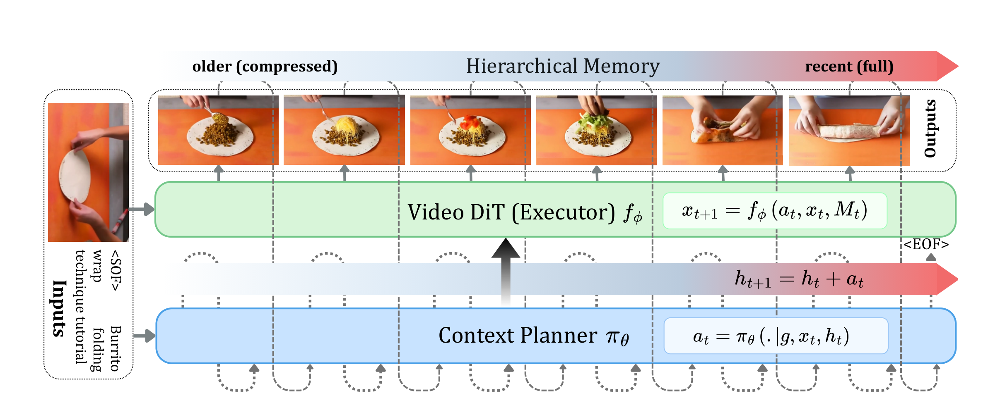
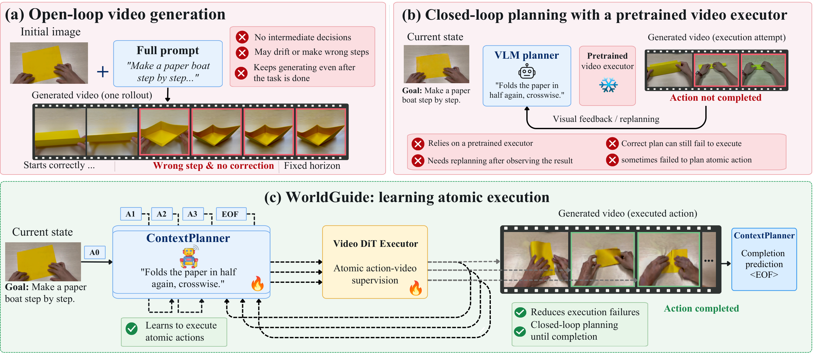
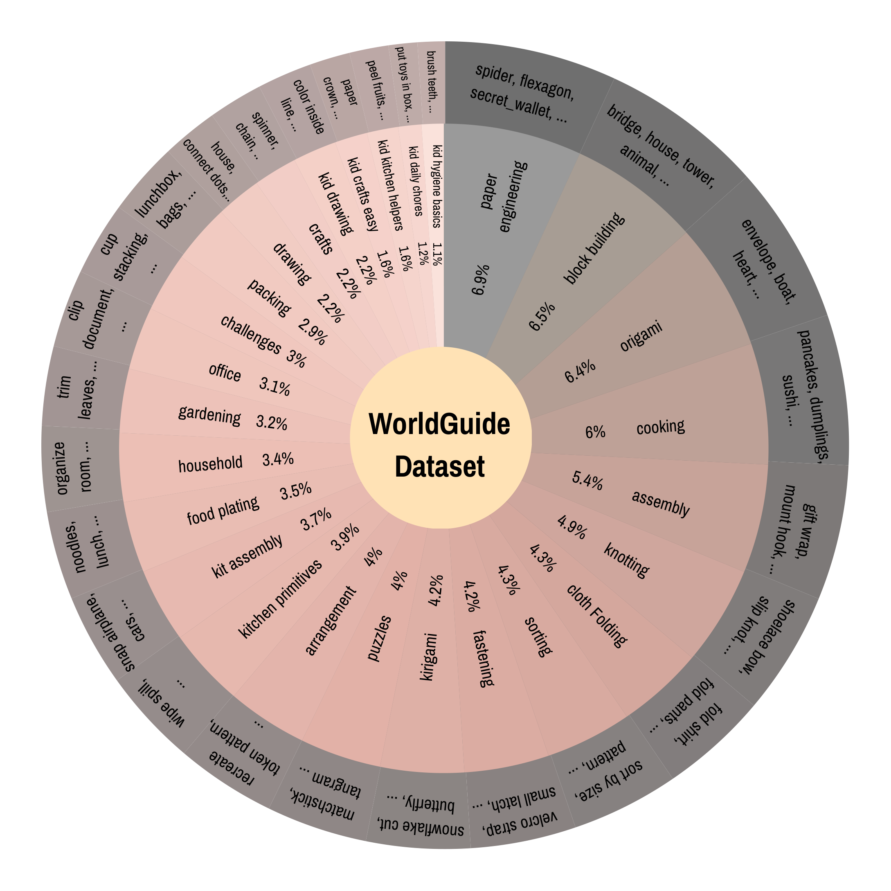

<div align="center">

# WorldGuide: Goal-Directed Video World Model for Procedural Task Execution

<p align="center">
  
</p>

[Ankan Deria](https://ankan8145.github.io), [Komal Kumar](https://komalkumar.org), [Hisham Cholakkal](https://hishamcholakkal.com), [Fahad Shahbaz Khan](https://sites.google.com/view/fahadkhans), [Salman Khan](https://salman-h-khan.github.io)

**Mohamed bin Zayed University of Artificial Intelligence**

[](https://arxiv.org/abs/XXXX.XXXXX)
[](https://PROJECT_PAGE_URL)
[](https://huggingface.co/HF_USER/WorldGuide)
[-ff9d00)](#)

</div>

<p align="center">
  
</p>

## Overview

**WorldGuide** is a framework for long-horizon, interactive world modeling. It decomposes multi-step procedures into atomic actions and executes them in a closed loop:

- **ContextPlanner** — a vision-language planner that observes the current state and history, predicts the next atomic sub-goal, and emits `<EOF>` when the task is complete.
- **Video DiT Executor** — a diffusion-transformer video generator conditioned on the planned action and cached visual-latent memory, producing consistent rollouts without appearance drift.

<p align="center">
  
  <br><em>(a) Open-loop generation drifts and cannot correct mistakes. (b) Planning with a frozen executor still fails to complete actions. (c) WorldGuide learns atomic execution and plans until completion.</em>
</p>

## Dataset

The WorldGuide dataset covers diverse multi-step procedural tasks — paper engineering, block building, origami, cooking, assembly, knotting, cloth folding, and more — each annotated with step-level action instructions.

<p align="center">
  
</p>

## Repository Structure

```text
worldGuide/
├── assets/          # Figures, sample frames, prompts
├── hyvideo/         # Model, pipelines (with visual memory), evaluation
├── scripts/
│   ├── inference/   # Closed-loop and text-only planner evaluation
│   └── training/    # Feature precomputation and distributed training
├── trainer/         # Training engine and dataset loaders
├── wan/             # Lightweight model modules
├── worldcompass/    # RL / trajectory post-training
├── download_models.py
└── requirements.txt
```

## Installation

```bash
conda create -n worldguide python=3.10 -y
conda activate worldguide

# Install PyTorch for your hardware (example: CUDA 12.4)
pip install torch torchvision torchaudio --index-url https://download.pytorch.org/whl/cu124
pip install -r requirements.txt
```

## Checkpoints & Data

Download the weights from [Hugging Face](https://huggingface.co/HF_USER/WorldGuide) (the dataset is coming soon), then arrange them as:

```text
ckpts/
├── HunyuanVideo-1.5/                         # Base video model
├── worldguide_planner/                       # ContextPlanner
└── worldguide_action/
    └── diffusion_pytorch_model.safetensors   # WorldGuide executor + memory weights
data/
├── train_manifest.json
├── train_manifest_precomputed.json           # Created by feature precomputation
└── test_manifest.json
```

## Inference

Run from the repository root. Trailing CLI arguments override defaults (e.g. `--start_index 0 --end_index 10 --gpu_ids 0,1 --max_parallel_jobs 2`).

**Closed-loop rollout with visual feedback and memory (main setting).** The planner sees the latest generated clips, predicts the next step, and the executor generates it with step-level memory (`mode2`, last 2 steps), until `<EOF>` or 70 steps.

```bash
bash scripts/inference/run_v5_qwen_closed_loop_memory.sh
# → ./outputs/testdata_v5_qwen_45frames  (45-frame clips, 30 steps, seed 3208, 8 GPUs)
```

**Text-only planner (no visual feedback).** Same executor; the planner sees only the task and its own step history.

```bash
bash scripts/inference/run_mem_qwen_no_visual.sh
# → ./outputs/testdata_mem_qwen_no_visual_33frames
```

## Training

**1. Precompute features** (video latents and prompt embeddings):

```bash
RAW_MANIFEST="data/train_manifest.json" \
OUTPUT_MANIFEST="data/train_manifest_precomputed.json" \
FEATURE_CACHE_DIR="data/origami_feature_cache" \
bash scripts/training/run_precompute_features.sh
```

**2. Distributed training** with visual-latent memory:

```bash
NPROC_PER_NODE=8 OUTPUT_DIR="./outputs/worldguide_train" \
bash scripts/training/run_train_worldguide.sh
```

| Option | Description |
|---|---|
| `--origami_memory_mode` | Memory mode (`mode2`: causal latent injection) |
| `--origami_memory_steps` | Number of past step latents kept in memory |
| `--origami_memory_blend` | Memory fusion factor (default `0.35`) |
| `--sp_size` | Sequence-parallel size (`1` or `4`) |

## Citation

```bibtex
@article{deria2026worldguide,
  title   = {WorldGuide: Goal-Directed Video World Model for Procedural Task Execution},
  author  = {Deria, Ankan and Kumar, Komal and Cholakkal, Hisham and Khan, Fahad Shahbaz and Khan, Salman},
  journal = {arXiv preprint arXiv:XXXX.XXXXX},
  year    = {2026}
}
```

## Acknowledgements

Built on [HunyuanVideo-1.5](https://github.com/Tencent-Hunyuan/HunyuanVideo-1.5) and [Wan](https://github.com/Wan-Video/Wan2.1).
